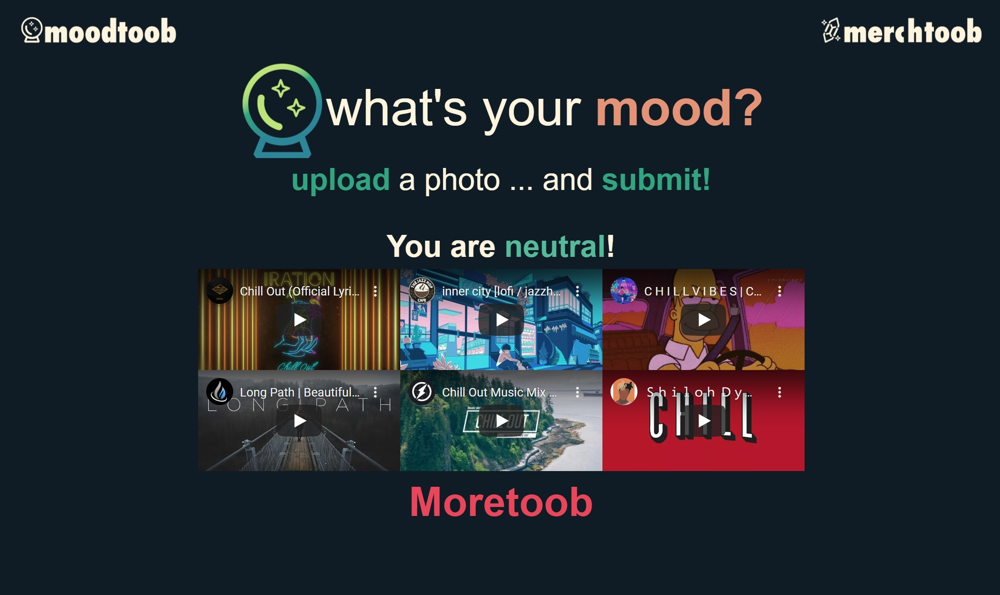

# Moodtoob

## An easy mood based recommender for music videos. ##

Music is wonderful and so is music discovery! By recommending content in a new way, we give users a route for discovery. 

Users pass our application a selfie, or upload an image from their computer. the Face++ API then analyzes the image, determines users mood, and returns a selection of Youtube videos based on their mood. 

Deployed site:[www.moodtoob.com](https://www.moodtoob.com)

Private working repository:(https://github.com/DeseanCarter/Moodtoob-)

Public working respository:(https://github.com/DeseanCarter/Moodtoob) 

My repo:(https://github.com/adumbcoder/Moodtoob-joshua)

