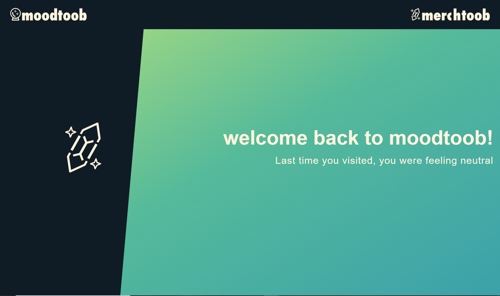

 
  # Moodtoob 

  

  
  [Description](#description) |
    [Installation](#installation) |
    [URL](#url) |
    [Contributions](#contributions) |
    [Tests](#tests) |
    [License](#license) |
    [Questions](#questions) |
    [GitHub](#github) |
    [Email](#email)
    
  ## Description:
  Music is wonderful and so is music discovery! By recommending content in a new way, we give users a route for discovery.

  ### Installation:
  Users pass our application a selfie, or upload an image from their computer. the Face++ API then analyzes the image, determines users mood, and returns a selection of Youtube videos based on their mood.

  ### URL:
  www.moodtoob.com

  ### Contributions:
  n/a

  ### Tests:
  n/a

  ### License:

  [Common License source](https://opensource.org/licenses)
  ## Questions.
  ### GitHub:
  [Adumbcoder](https://adumbcoder.github.io/PersonalProfile/)

  ### Email:
  pickensprogramming@gmail.com

  -[Back to Top](#)

## Screenshots:

